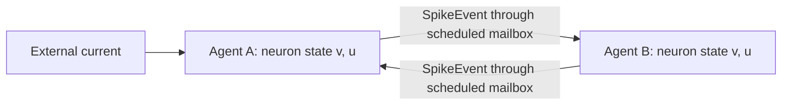

# Two communicating neuron agents

A standalone starting point for a network of computational agents. Each agent
owns one Izhikevich neuron, receives spike messages, integrates its own state,
and sends a spike to its peer when it fires. Uses Python 3.9+ and only the standard
library; no LLM, API key, database, or installation is required.

## Run

From the repository root:

```bash
python3 -m neuron_agents
python3 -m unittest discover -s tests -v
```

The default experiment injects current 10 into A from 10 ms to 250 ms. B has no
external drive, so its firing demonstrates input from A. Both connections are
excitatory: A → B has weight 20, and B → A has weight 5. The simulation runs for
300 ms of simulated time, with no wall-clock sleeps.

```bash
# Disconnect A → B: B should remain silent.
python3 -m neuron_agents --weight-ab 0 --output output/disconnected
# Try inhibitory feedback from B to A.
python3 -m neuron_agents --weight-ba -5 --output output/inhibitory
# Refine the numerical timestep.
python3 -m neuron_agents --dt-ms 0.05 --output output/finer
python3 -m neuron_agents --help
```

Each run writes `traces.csv` (voltage, recovery, input currents, spike flags),
`messages.csv` (source, target, emission time, scheduled delivery time, weight),
and `config.json` (including each neuron's parameters). Reusing an output directory
replaces these files. All state is fresh for each run.

## How the agents communicate

This prototype keeps typed messages, local agent state, and explicit routing,
implemented with dataclasses and a scheduled mailbox instead of LlamaIndex.
The two agents are Python objects in one process. The coordinator owns timing
and transport; it is not a third agent. Integration runs even during silence,
because a neuron must continue evolving between incoming spikes.



## Model and timing

The equations and regular-spiking defaults follow
[Izhikevich (2003), Simple Model of Spiking Neurons](https://www.izhikevich.org/publications/spikes.pdf):

```text
dv/dt = 0.04*v*v + 5*v + 140 - u + I
du/dt = a*(b*v - u)
if v >= 30: v = c; u = u + d

a = 0.02, b = 0.2, c = -65, d = 8
initial v = c, initial u = b*v
```

Time uses the model's millisecond scale and voltage its millivolt scale. Currents
and weights use model input units, not a calibrated physical current unit.
The implementation uses simultaneous forward Euler at 0.1 ms by default,
checking the cutoff after each update. It is a numerical approximation;
smaller timesteps can change spike times. It does not reproduce the paper's
split voltage-update numerical scheme.

The synapse is a prototype design choice: receipt of a spike adds its signed
weight to the receiver's synaptic current. That current decays exponentially
with `tau_ms` (default 5 ms). Total input is external plus synaptic current.
This adds synaptic state outside the two neuron equations. Positive weights
excite; negative weights inhibit. Defaults illustrate communication rather
than fit a biological circuit.

For each interval `[t, t + dt)` the coordinator:

1. Delivers all messages scheduled for `t`.
2. Advances both neurons using their incoming currents and external drive.
3. Records samples and any spikes at `t + dt`, then schedules those spikes for
   `t + dt + delay_ms` (default delay 1 ms).

The delivery delay must be at least one timestep. Delay and duration must be
integer multiples of `dt_ms`. Both agents advance before routing new spikes,
so agent iteration order cannot create immediate feedback. External drive is
active when the interval start is within `[stimulus_start_ms, stimulus_end_ms)`;
off-grid stimulus boundaries therefore take effect at the next grid point.

Trace timestamps are interval ends. `v` and `u` are post-reset values; use
`fired` to locate spikes (a plot can display those points at +30 mV). Recorded
currents are the inputs used during that interval, before synaptic decay.
The message file logs scheduled messages, including ones whose delivery time
is at or after the simulation end; those are not delivered during this run.

## Extend

- `neuron_agents/model.py`: equations, reset, and neuron parameters.
- `neuron_agents/workflow.py`: agents, messages, synaptic input, routing.
- `neuron_agents/__main__.py`: command line and CSV output.
- `tests/test_neurons.py`: numerical updates, reset, silence and firing,
  causal delivery, feedback, repeatability, and timestep refinement.

For different neuron parameters or programmatic experiments:

```python
from neuron_agents.model import Parameters
from neuron_agents.workflow import Config, NeuronWorkflow

config = Config(parameters_b=Parameters(a=0.1, b=0.2, c=-65, d=2))
result = NeuronWorkflow(config).run()
```

A future LLM-based agent can consume the numerical events or
configure experiments while keeping the equation solver deterministic.
